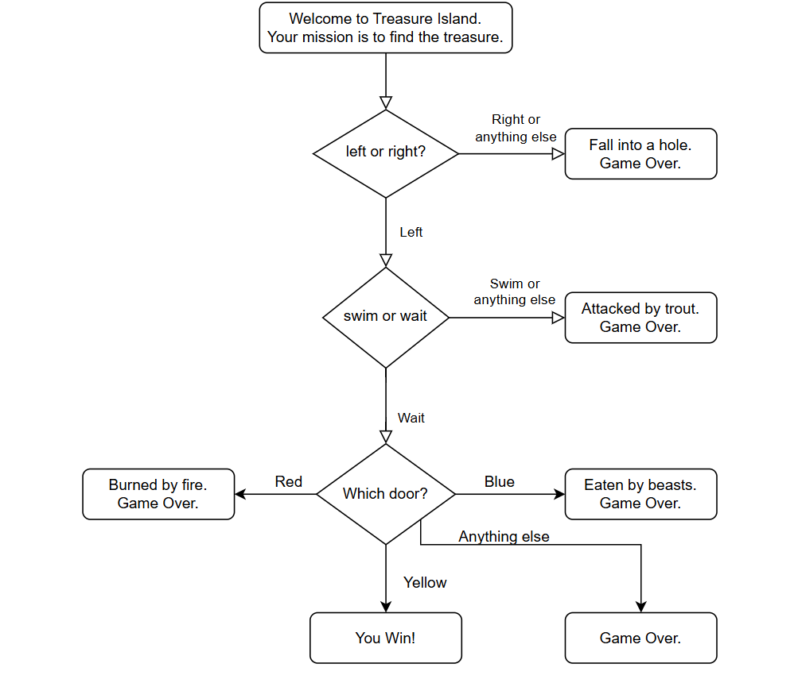

# Treasure Island Game 🏝️

A Python-based text adventure game where players navigate Treasure Island by making decisions to find the hidden treasure.

## Problem Statement
Navigate the island by:
1. Choosing the correct direction.
2. Deciding whether to swim or wait.
3. Picking the correct door.

Each decision can lead to victory or a game-ending scenario.

## Features
- User input-driven gameplay.
- Game-ending scenarios for incorrect choices.
- A fun way to practice conditional statements and user interaction.

## How to Play
1. Run the game:
   ```bash
   python treasure_island.py

## Sample Output
Welcome to Treasure Island.
Your mission is to find the treasure.
Do you want to go left or right (L/R)? L
Swim or Wait (S/W)? W
Which door? Red, Blue, or Yellow (R/B/Y)? Y
You win!!

## Game Logic
The game’s logic flow is as follows:
